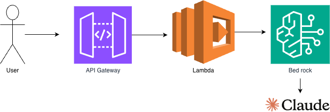

# AI Chatbot（Bedrock × Lambda）

AWS Lambda + Amazon Bedrockを活用したサーバーレスAIチャットボットです。

## アーキテクチャ

## 構成サービス

- **Amazon API Gateway** - HTTPリクエストの受付
- **AWS Lambda** - バックエンド処理（Python）
- **Amazon Bedrock** - Claude Sonnet 4.6による生成AI応答

## 機能

- 日本語対応のAIチャットボット
- サーバーレス構成によるコスト最適化
- CORS対応によるブラウザからの直接アクセス

## デモ

[https://swell-webworks.com/chatbot.html](https://swell-webworks.com/chatbot.html)

## 使用技術

- Python 3.14
- AWS Lambda
- Amazon API Gatewa
