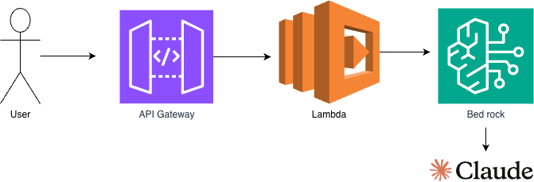
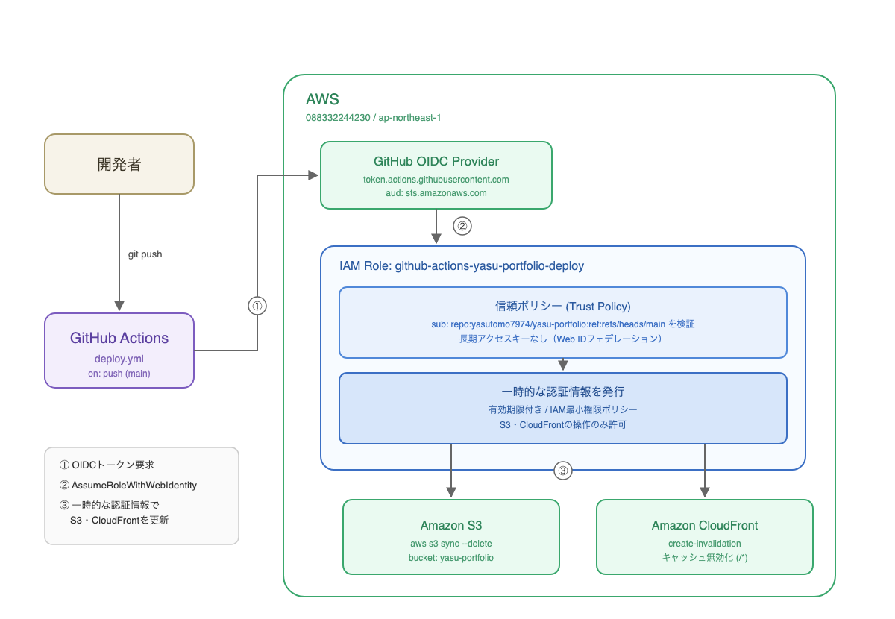

# AI Chatbot（Bedrock × Lambda）

AWS Lambda + Amazon Bedrockを活用したサーバーレスAIチャットボットです。

## アーキテクチャ

## 構成サービス

- **Amazon API Gateway** - HTTPリクエストの受付
- **AWS Lambda** - バックエンド処理（Python）
- **Amazon Bedrock** - Claude Sonnet 4.6による生成AI応答

## 機能

- 日本語対応のAIチャットボット
- サーバーレス構成によるコスト最適化
- CORS対応によるブラウザからの直接アクセス

## デモ

[https://swell-webworks.com/chatbot.html](https://swell-webworks.com/chatbot.html)

## 使用技術

- Python 3.14
- AWS Lambda
- Amazon API Gateway

---

# GitHub Actions × OIDC 自動デプロイ

本ポートフォリオサイト（S3 + CloudFront）は、GitHub ActionsからOIDC（OpenID Connect）フェデレーションを使ってAWSへデプロイしています。IAMの長期アクセスキーをGitHub Secretsに保存せず、ワークフロー実行時だけ有効な一時的な認証情報でAWSリソースを操作する構成です。

## アーキテクチャ

## 仕組み

1. **OIDCトークン要求** — `main`ブランチへのpushをトリガーに、GitHub ActionsのワークフローがGitHubのOIDCプロバイダー（`token.actions.githubusercontent.com`）に対して、実行中のワークフローを証明する短命なIDトークンを要求する。
2. **AssumeRoleWithWebIdentity** — 取得したIDトークンを使い、`aws-actions/configure-aws-credentials`アクションがAWS STSの`AssumeRoleWithWebIdentity`を呼び出す。IAMロール（`github-actions-yasu-portfolio-deploy`）の信頼ポリシーが、トークンの`aud`（audience）と`sub`（対象リポジトリ・ブランチ）を検証し、条件に一致した場合のみロールの引き受けを許可する。
3. **一時的な認証情報でデプロイ** — 発行された有効期限付きの一時認証情報を使い、`aws s3 sync`でS3バケットへ静的ファイルを同期し、続けて`aws cloudfront create-invalidation`でCloudFrontのキャッシュを無効化する。

この方式により、AWSの長期アクセスキー（Access Key ID / Secret Access Key）をGitHub Secretsなどに保存する必要がなく、トークンの有効期限が切れれば認証情報も自動的に無効になるため、キー漏えいのリスクを大幅に低減できる。

## 構成サービス

- **GitHub Actions** - `push`トリガーでのCI/CDワークフロー実行
- **IAM OIDCプロバイダー / IAMロール** - GitHubが発行するOIDCトークンを検証し、一時的な認証情報を発行
- **Amazon S3** - 静的サイトファイルのホスティング
- **Amazon CloudFront** - 配信・キャッシュ無効化

## 使用技術

- GitHub Actions（`aws-actions/configure-aws-credentials`）
- AWS IAM（OIDC / Web IDフェデレーション）
- AWS CLI（`s3 sync` / `cloudfront create-invalidation`）
